# Laboratorio de Migración de Aplicación Multi-tier a Servicios Gestionados de AWS

Este laboratorio tiene como objetivo refactorizar una aplicación web multi-tier basada en Java, migrándola desde una infraestructura basada en instancias EC2 independientes a una arquitectura basada en servicios gestionados de AWS. Esto facilitará la gestión, mejorará la escalabilidad y optimizará los costos.

## ESTADO INICIAL
La aplicación actualmente utiliza una serie de tecnologías, desplegadas cada una en su propia instancia EC2:
- Nginx
- RabbitMQ
- Apache
- MySQL
- Memcach
Configurar y mantener cada una de estas instancias conlleva un tiempo y esfuerzo considerable. Además, la variabilidad de las versiones del sistema operativo puede complicar la replicación y escalabilidad de la infraestructura.

## DESAFIOS IDENTIFICADOS
- Tiempo de configuración y mantenimiento elevado.
- Complejidad en la replicación y escalabilidad.
- Carga operacional significativa en monitoreo y actualizaciones.
😰😰 Esta metodologia tambien agrega mucho trabajo al equipo de operacines a nivel de monitoreo, configuracion, actualizaciones y demas. Para disminuir la carga operacion podemos optar por servicios **PaaS y SaaS**, eso es lo que haremos en este lab.

## SERVICIOS PAAS Y SAAS EN AWS

### 1. Amazon Elastic Beanstalk para Apache
- Antes: Apache en EC2.
- Después: Beanstalk proporciona una plataforma preconfigurada para desplegar aplicaciones Java, integrando servicios como Load Balancer para reemplazar Nginx.

### 2. Amazon RDS para MySQL
Servicio PaaS de AWS para bases de datos, soporta variedad de BD engines, entre ellos MySQL que era el que usabamos antes.

Antes: MySQL en EC2.
Después: RDS facilita la gestión de bases de datos, mejorando la seguridad y la escalabilidad.

### 3. Amazon Elastic Cache en lugar de Memcache
Antes: Memcache en EC2.
Después: Elastic Cache ofrece un sistema de caché en memoria gestionado, con alta disponibilidad.

### 4. Amazon MQ para RabbitMQ
Antes: RabbitMQ en EC2.
Después: Amazon MQ es un servicio de mensajería gestionado compatible con RabbitMQ.

### 5. Extras: Route 53: Para la gestión de DNS.
Amazon CloudFront: Para la distribución de contenido a nivel global.

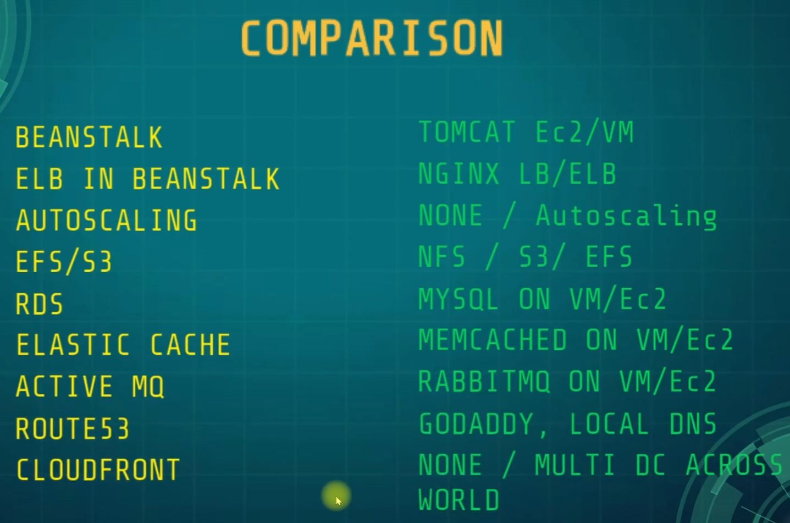

## ARQUITECTURA PROPUESTA:
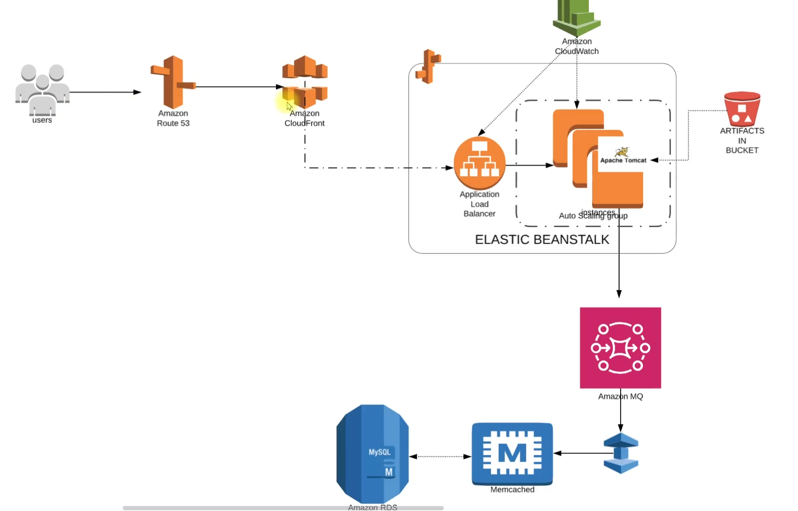
La arquitectura ilustra una aplicación web multi-tier en AWS:

Amazon Route 53: Dirige el tráfico de los usuarios a la aplicación.

Amazon CloudFront: Distribuye el contenido estático con baja latencia.

Elastic Beanstalk: Orquesta la implementación y escalado automático de la aplicación, utilizando Apache Tomcat y soportando la carga con un balanceador.

Application Load Balancer: Balancea el tráfico a las instancias dentro de Elastic Beanstalk.

Auto Scaling Group: Ajusta automáticamente el número de instancias EC2 según la demanda.

Amazon CloudWatch: Monitorea la aplicación y la infraestructura, proporcionando alertas y métricas.

Artifacts Bucket: Almacena los artefactos de la aplicación en un bucket de Amazon S3.

Amazon RDS para MySQL: Gestiona la base de datos de la aplicación con el motor MySQL.

Memcached: Mejora el rendimiento de la base de datos, presumiblemente usando ElastiCache.

Amazon MQ: Facilita la comunicación entre componentes con colas de mensajes.
La configuración busca mejorar la escalabilidad, disponibilidad y mantenimiento de la aplicación a través de los servicios gestionados de AWS.

## PROCESO DE MIGRACION 
### Creacion de grupos de seguridad
Para los servicios de backend, permitimos todo el trafico interno y determinados puertos desde el grupo de seguridad del frontend, osea el servicio de Tomcat que estara en Beanstalk.
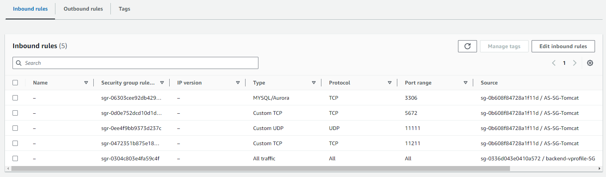

### Consola RDS
1. Creamos un RDS subnet, que nos permite definir en que zonas de disponibilidad se ubicara nuestra DB, podemos usar la que esta por defecto, yo cree una que contiene todas las AZ y todas las subredes.
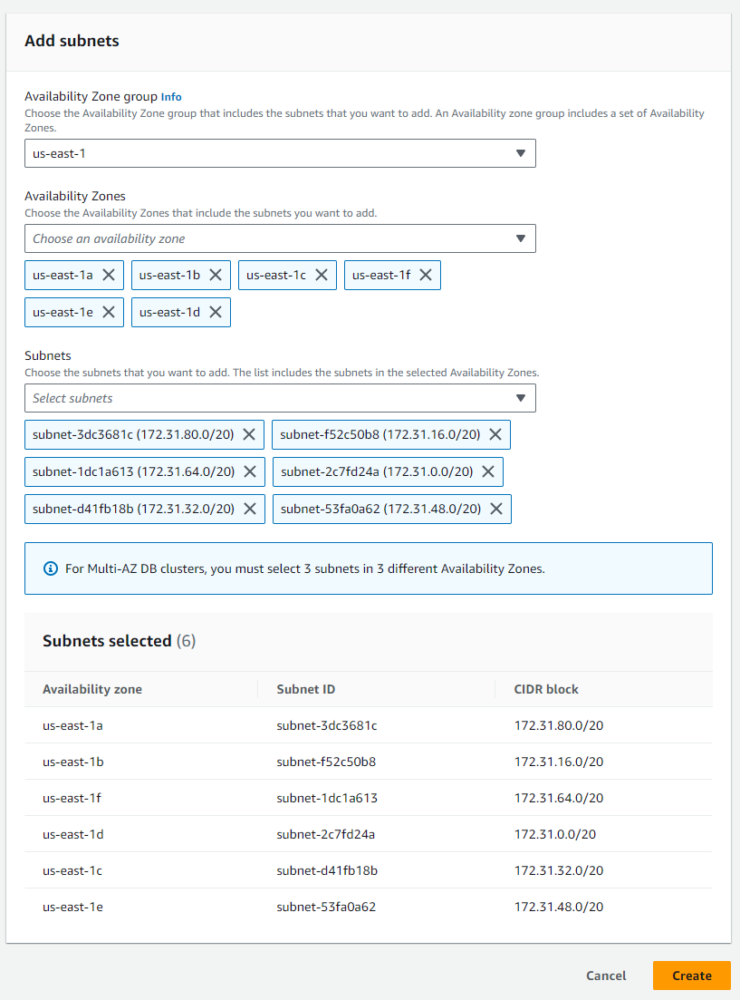

2. Crearemos una base de datos usando el motor MySQL, aunque tambien podriamos usar el motoro de Aurora compatible con MySQL, suele ser mas economico y con mayor rendimiento.
La version sera 8.x.x y el template de **free tier**. 
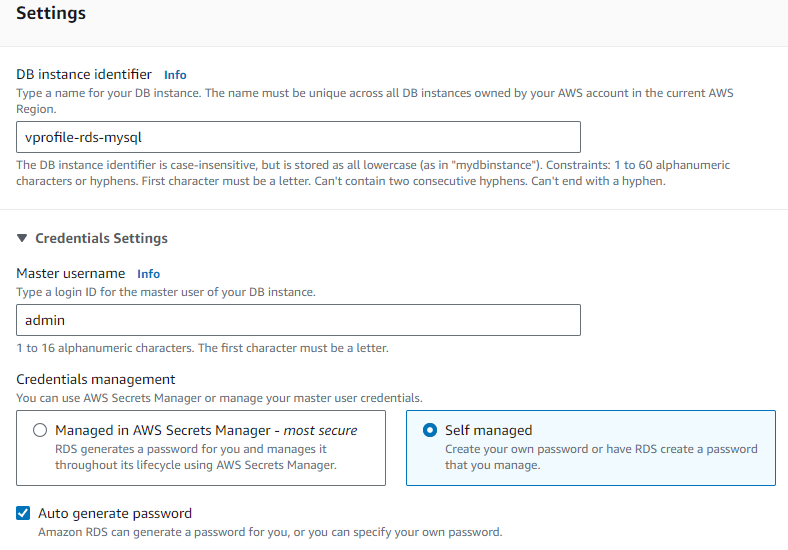
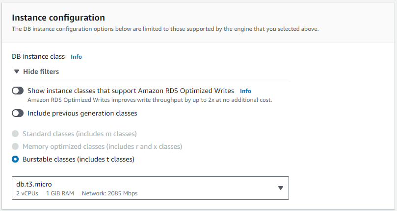
En un entorno de produccion para el storage hubieramos elegido un tipo IOPS com mayor capacidad.
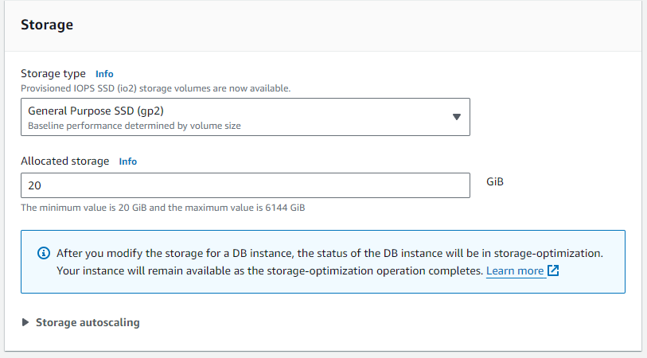
Configuracion de red, bloqueamos el acceso publico, de manera que solo sea accesible en la misma VPC, el grupo de seguridad debe ser el que creamos para los servicio de backend.
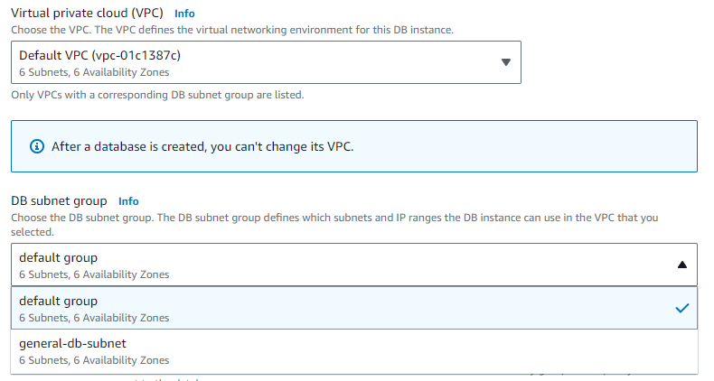
NO OLVIDAR SETEAR LA TABLA INICIAL PARA INICIAR LA BASE DE DATOS.

NO OLVIDAR COPIAR LAS CREDENCIALES DE LA BASE DE DATOS QUE ACABAMOS DE CREAR:
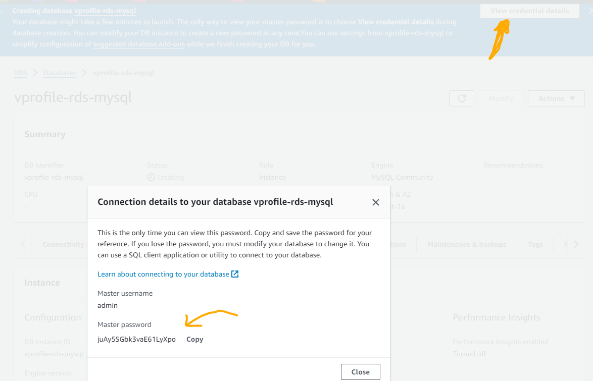

### Consola ElastiCache
Se puede crear un cluster, pero crearemos una sola instancia.
- Igual que al crear el RDS, crearemos previamente un subnet group con todas las subredes de la VPC.
- Podemos crear instancias tanto de Memcached como de Redis, esta vez iremos con Memcached.
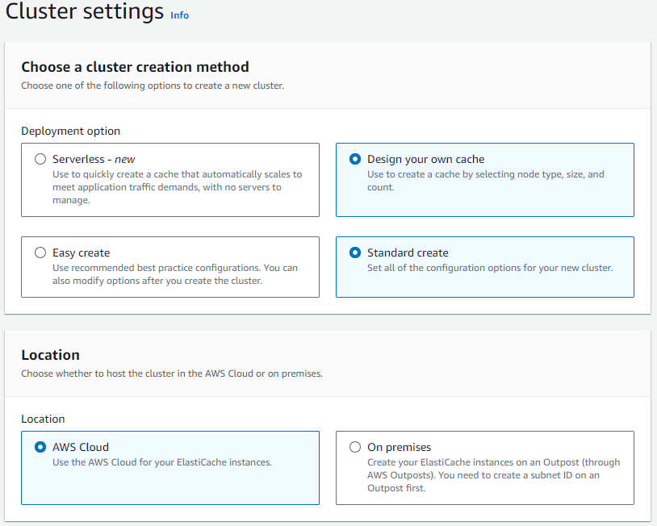
IMPORTANTE SELECCIONAR UN TIPO DE NODO t2.micro para entrar en el free tier, agregar el grupo de seguridad de servicios backend.

### Consola AmazonMQ
Ya en la consola damos a crear broker, podemos elegir entre ApacheMQ y RabbitMQ, iremos por el ultimo esta vez con una sola instancia. APUNTA las credenciales!!
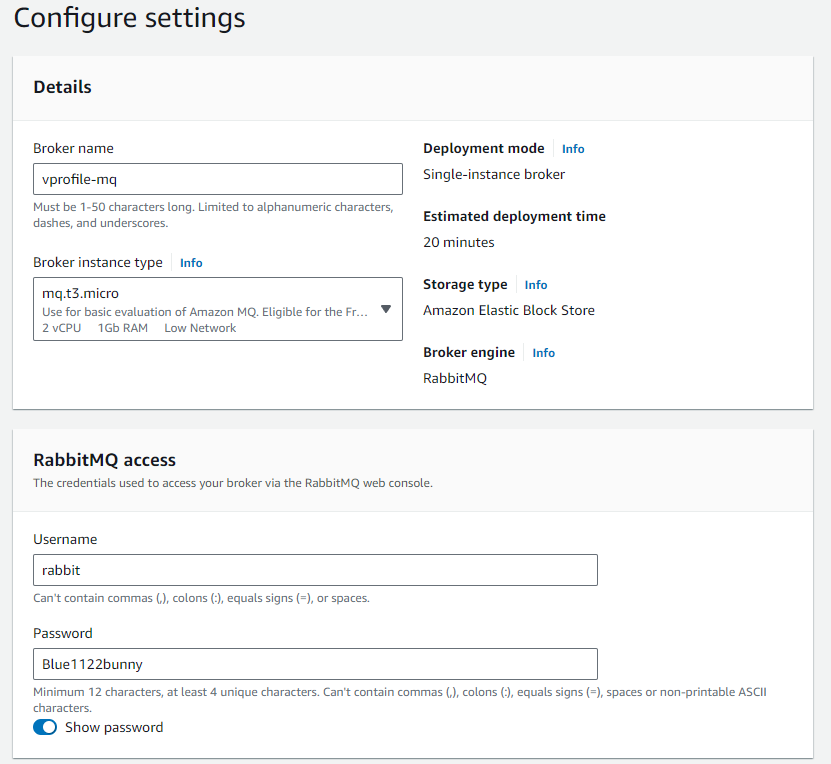
En opciones avanzadas optaremos por tipo de acceso privado, ya que quien accedera es Beanstalk y estaran en la misma VPC, tambien usar el grupo de seguridad de backend.
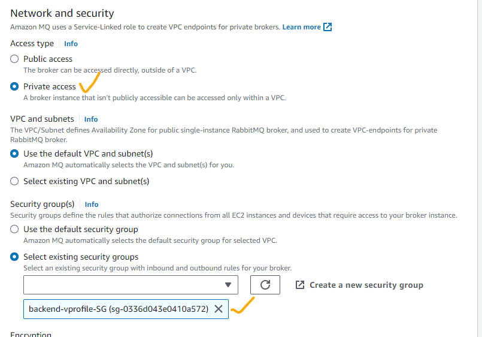