## GRUPOS DE SEGURIDAD
Se crearon 3 grupos de seguridad:


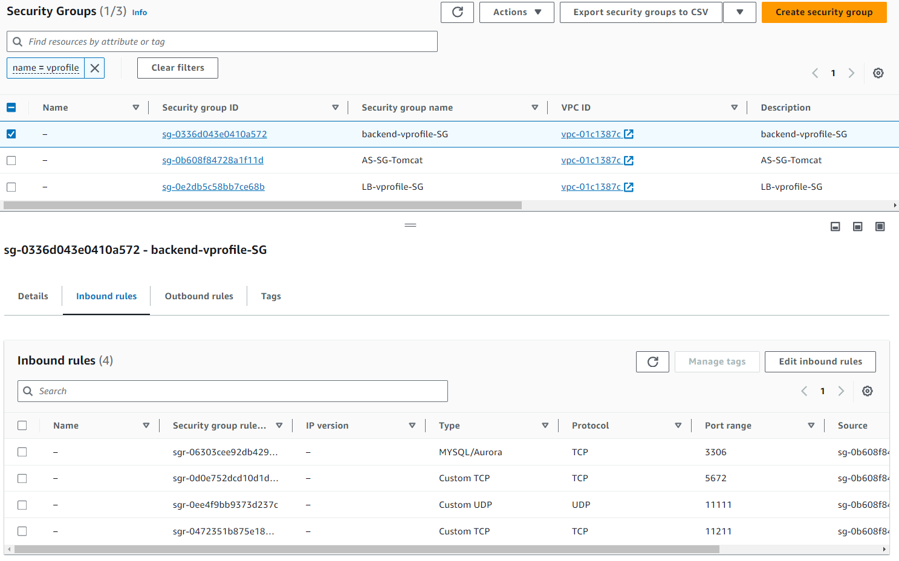


## EC2 INSTANCES
Aqui desplegaremos los servicios de la aplicacion.
1. Para la aplicacion aprovisionaremos un ASG con Tomcat que hosteara la app web.
2. Backend de la app: Aqui estaran MemCachm, MySQL y RabbitMQ.
### MySQL EC2
Esta instancia recibira el user data de [mysql.sh](userdata/mysql.sh), que instala y configura mariaDB, sube el backup de la base de datos en [db_backup.sql](src/main/resources/db_backup.sql), finalmente habilita el FW de linux para permitir trafico entrante solo en el puerto MySQL, de esta forma tenemos seguridad a nivel de SG y de SO.
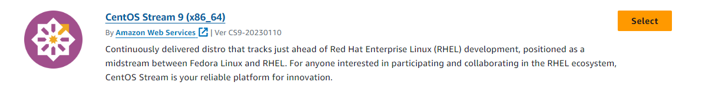
- No olvidar agregar el Security Group creado para el backend.
- En opciones avanzadas, seccion USER DATA, copiar el script de [mysql.sh](userdata/mysql.sh).

Para probar el backup del DB en la instancia:
```ssh
sudo systemctl status mariadb
mysql -u admin -padmin123 accounts
```
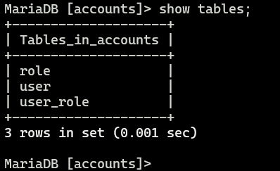

### Memcach y RabbitMQ
Seguir los mismos pasos que para MySQL, misma AMI de CentOS, mismos grupos de seguridad, solo el USER DATA cambiara entre cada servicio.

MEMCACH proccess:

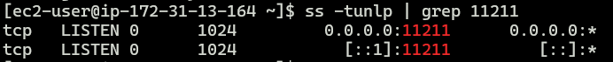

RABBITMQ process:
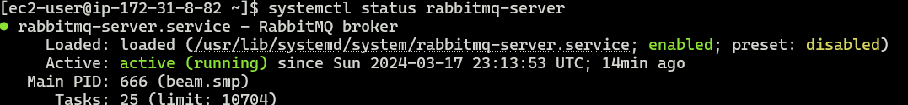

### App01 - Tomcat
Usaremos Ubuntu 22.04 como AMI, usar el grupo de seguridad que creamos para Tomcat o el grupo de ASG. No olvidar adjuntar el USER DATA correspondiente [tomcat_ubuntu.sh](userdata/tomcat_ubuntu.sh).
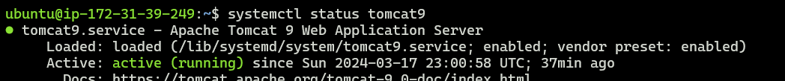

## ROUTE 53
Creamos un private hosted zone, tiene sentido a nivel de VPC, en una region especifica.
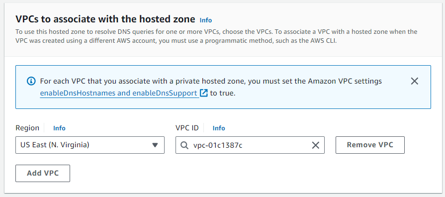
1. Create record, simple routing. Creamos los records apuntando a las IPs privadas correspondientes.
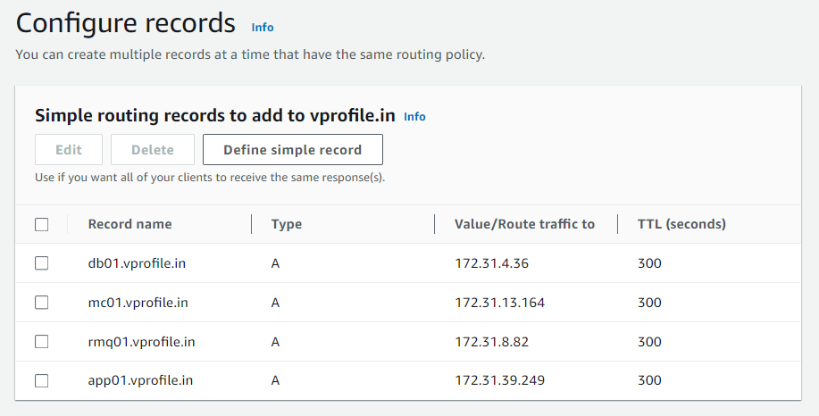

## BUILDING AND UPLOADING ARTIFACT
Antes de realizar la construccion del artifact, modificaremos las propiedades de la aplicacion en [application.properties](src\main\resources\application.properties).
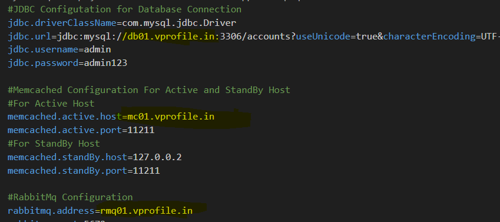, esto en base a los nombres de dominio que configuramos en Route53.

- BUILDING: En la ruta donde se encuentra el archivo pom.xml ejecutamos mvn install, esto nos dara como resultado el directorio **target**.

´´´
aws s3 cp target/vprofile-v2.war s3://mlunabucketdemo/
´´´
- EC2 APP01: Configuro un rol para que pueda descargar el artifact desde el bucket S3.
´´´
aws s3 cp s3://mlunabucketdemo/vprofile-v2.war /tmp/

sudo systemctl stop tomcat9
sudo rm -rf /var/lib/tomcat9/webapps/ROOT
sudo cp /tmp/vprofile-v2.war /var/lib/tomcat9/webapps/ROOT.war
sudo systemctl start tomcat9

 sudo cat /var/lib/tomcat9/webapps/ROOT/WEB-INF/classes/application.properties
´´´
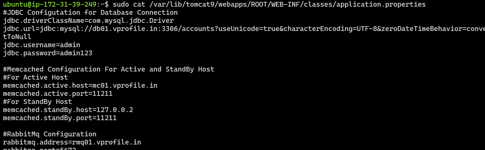

## LOAD BALANCER

### TARGET GROUP
- Healthcheck en la ruta /login, puerto 8080.
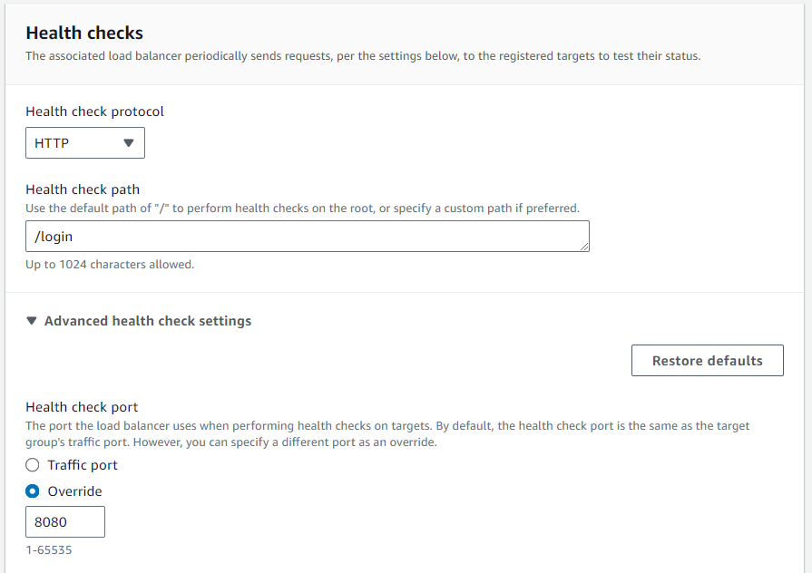


PASSWORD AND USERNAME: admin_vp

## AUTOSCALING GROUP
Crearemos una imagen a partir de la instancia Tomcat ya aprovisionada y configurada. Luego en base a esta imagen creamos un launch template que herede los SG, rol IAM, el user data no es ncesario.

Creamos el AutoScaling group con el template correspondiente, las zonas de disponibilidad que cubre el LB maximo y atacheamos el SG con el TG ya creado. Habilitamos el healthcheck para el ASG.

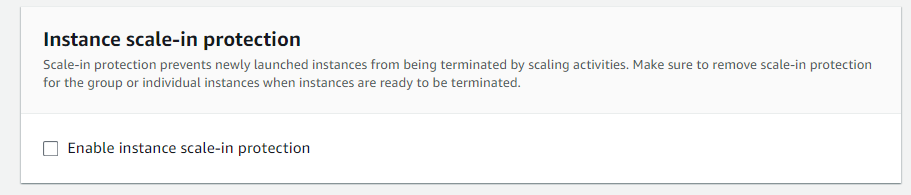
Con esta opcion el ASG ya no envia trafico a la instancia dañada pero no la termina para temas de troubleshooting.